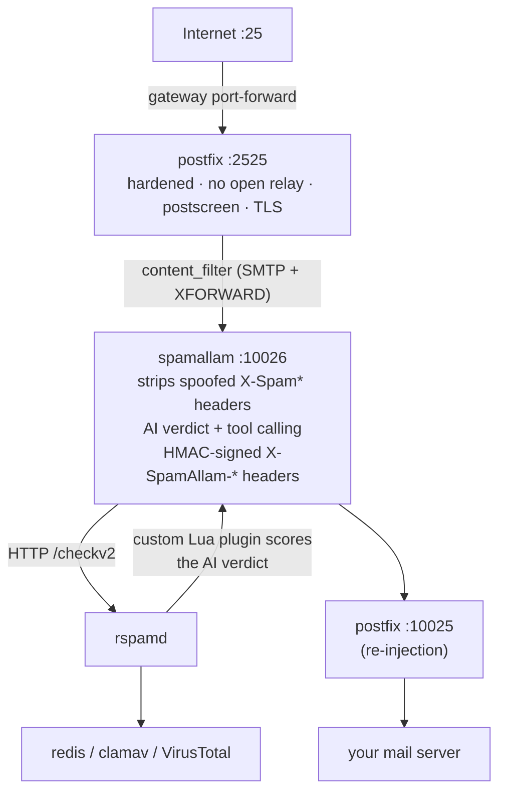

# 🦙 SpamAllam

A containerized **secure inbound e-mail gateway** that fronts an internal mail
server (built for Synology MailPlus, works with any SMTP server). Inbound mail
terminates at a hardened postfix instead of your mail server, gets **AI-analyzed
by an LLM of your choice** (OpenAI / Claude / any local OpenAI-compatible model),
scored by a full **rspamd** baseline (bayes, RBLs, SPF/DKIM/DMARC/ARC, ClamAV,
VirusTotal, fuzzy), and only then relayed inward.



Shown above is the default order (AI first, so rspamd's `SPAMALLAM_*` symbols
reflect the AI verdict). The AI ↔ rspamd order is admin-configurable on the
AI settings page — flipping to rspamd-first lets rspamd's free local baseline
score the message before any LLM call, with an optional bypass to skip AI
entirely when rspamd already rejects (mail is dropped either way, so this is
a pure cost optimization for paid LLM providers).

High-confidence phishing/malware is silently dropped; everything else is
delivered carrying verdict headers (`X-Spam-Flag`, `X-Spam-Status`,
`X-SpamAllam-*`) that your mail server's rules can file into folders.

## Features

- **Hardened inbound-only postfix** — no open relay, no auth, no privileged
  ports anywhere; postscreen + DNSBLs, strict HELO/pipelining/junk-command
  limits, TLS with LetsEncrypt certs, domain-level recipient validation with
  plus-addressing support. Reached via its own macvlan LAN IP rather than
  docker port-publish NAT, so `mynetworks` always sees genuine client source
  IPs — no NAT-rewrite path to accidentally trust an internet sender as local.
- **spamallam AI filter** — pluggable LLM provider (OpenAI, Claude, or a custom
  OpenAI-compatible endpoint incl. optional **mTLS client-certificate auth**),
  organization/recipient context so *expected* bulk mail is HAM and
  spear-phishing stands out, and evidence-gathering **tool calling**:
  GeoIP/rDNS, RIR (ARIN/RIPE/APNIC/…) ownership correlation of sender IPs and
  link/image hosts, RDAP domain age, MX/SPF/DMARC + brand-impersonation checks,
  web search + guarded page fetch (message URLs are **never** fetched),
  shared-provider (SendGrid/SES/Mailchimp/ACS…) masquerade detection, and a
  guard-railed **UniFi network-block** integration.
- **rspamd best-practice baseline** — redis-backed bayes with autolearn, RBLs,
  SPF/DKIM/DMARC/ARC, ClamAV + optional VirusTotal, fuzzy check; a custom Lua
  plugin converts the HMAC-verified AI headers into weighted symbols (only
  when AI ran before rspamd for that message — see pipeline order above). The
  GPT module is deliberately disabled.
- **Passkey-only admin UI** — FIDO2 WebAuthn (no passwords exist), one-time
  setup token bootstrap, invite links, multiple device-bound passkeys per user,
  full technical message traces, and an append-only admin audit log. All state
  is file-based YAML/JSONL under one volume; secrets are AES-256-GCM encrypted
  at rest.
- **Quarantine** — every dropped message is held (encrypted at rest, auto-expiry
  after a configurable retention, default 90 days) for review: filter, preview
  the rendered HTML with remote images/tracking pixels stripped, permanently
  delete, or **release** it for delivery (optionally whitelisting the sender).
  An admin can scope non-admin users to specific e-mail addresses so they only
  see and release their own quarantined mail. See
  [docs/QUARANTINE.md](docs/QUARANTINE.md).
- **acme.sh certificate container** — DNS-01 issuance/renewal into a shared
  volume it alone can write; postfix and spamallam hot-reload on rotation.

## Quick start

```bash
cp .env.example .env
# edit .env — at minimum: MAIL_HOSTNAME, MAIL_DOMAINS, MAILSERVER_HOST/PORT,
# HEADER_HMAC_KEY + SECRETS_KEY (openssl rand -hex 32 each), RSPAMD_PASSWORD
docker compose up -d --build
```

Then:

1. **Forward WAN :25 → `POSTFIX_MACVLAN_IP`:2525** at your gateway (UniFi: see
   [docs/UNIFI.md](docs/UNIFI.md)). Optionally :587 → :2587. postfix is reached
   directly on its own macvlan LAN IP, not the docker host — see
   `MACVLAN_*`/`POSTFIX_MACVLAN_IP` in `.env.example`.
2. **Enroll the first admin**: `docker logs spamallam-app` prints a one-time
   `https://<host>:8443/setup?token=…` link — open it and register a passkey.
3. In the admin UI: configure the **LLM provider** (use *Test* to see a full
   sample-analysis trace), write your **context**, enable **tools**, then flip
   **AI analysis** on.
4. Point your MX at `MAIL_HOSTNAME` and make sure its rDNS/PTR matches.

Synology-specific deployment (Portainer, moving MailPlus off :25, folder rules
on the verdict headers): [docs/SYNOLOGY.md](docs/SYNOLOGY.md).

## DNS prerequisites

| Record | Value |
|---|---|
| MX for each of `MAIL_DOMAINS` | `MAIL_HOSTNAME` |
| A/AAAA `MAIL_HOSTNAME` | your WAN IP |
| PTR (rDNS) of WAN IP | `MAIL_HOSTNAME` (ask your ISP) |
| ACME | DNS-01 provider credentials in `.env` |

## Repository layout

```
docker-compose.yml     the whole stack (postfix, spamallam, rspamd, redis, clamav, acme)
.env.example           every tunable, documented
postfix/               hardened inbound-only relay (config rendered from env)
rspamd/                local.d baseline + spamallam Lua plugin
spamallam/             Python service: SMTP filter, AI engine, tools, admin UI, tests
acme/                  acme.sh issuance/renewal container
docs/                  SYNOLOGY.md · UNIFI.md · SECURITY.md · QUARANTINE.md
```

## Security model

See [docs/SECURITY.md](docs/SECURITY.md) for the threat model. Highlights:
inbound `X-Spam*` headers are stripped and replaced with HMAC-signed ones;
the admin UI is HTTPS + WebAuthn-only and must never be WAN-exposed; secrets
on disk are ciphertext under a runtime-supplied master key; every container
runs `no-new-privileges` with minimal capabilities; DROP is a silent discard —
this gateway never generates backscatter.

## Tests

```bash
cd spamallam
pip install -e .[test]
pytest
```

## License

MIT — see [LICENSE](LICENSE).
